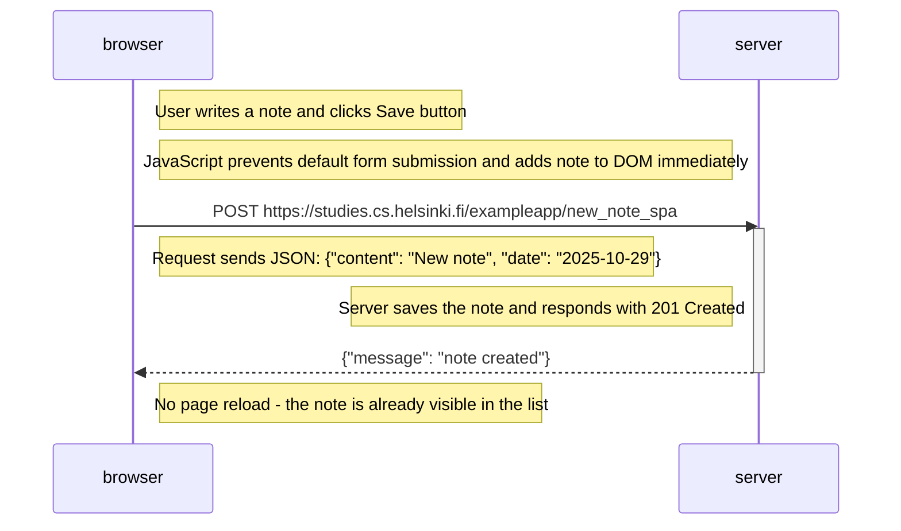

```mermaid
sequenceDiagram
    participant browser
    participant server

    Note right of browser: User writes a note and clicks Save button

    Note right of browser: JavaScript prevents default form submission and adds note to DOM immediately

    browser->>server: POST https://studies.cs.helsinki.fi/exampleapp/new_note_spa
    activate server
    Note right of browser: Request sends JSON: {"content": "New note", "date": "2025-10-29"}
    Note left of server: Server saves the note and responds with 201 Created
    server-->>browser: {"message": "note created"}
    deactivate server

    Note right of browser: No page reload - the note is already visible in the list
```